# 🧠 FlashMaster - Spaced Repetition Learning App

FlashMaster, Python (Flask) tabanlı, kullanıcıların **Aralıklı Tekrar (Spaced Repetition)** yöntemiyle verimli öğrenmesini sağlayan tam kapsamlı bir web uygulamasıdır. 

Sıradan bir kart uygulamasının ötesinde, **Leitner Sistemi** algoritmasını kullanarak kullanıcının öğrenme performansına göre kartları otomatik olarak zamanlar.

## 🚀 Özellikler

* **Akıllı Çalışma Algoritması (Leitner System):** Rastgele kart çekmek yerine, sadece zamanı gelmiş kartları gösterir.
    * ✅ Bilinen kartlar: Tarihi ileri atılır (3 gün, 1 hafta, 1 ay...).
    * ❌ Bilinmeyen kartlar: Cezalı olarak en başa (Kutu 1) döner.
* **Kullanıcı Yönetimi:** Güvenli kayıt olma, giriş yapma ve oturum yönetimi (Flask-Login).
* **CRUD Operasyonları:** Deste (Deck) ve Kart (Card) oluşturma, okuma, güncelleme ve silme.
* **Modern Arayüz:** Bootstrap 5 ile geliştirilmiş, tamamen responsive (mobil uyumlu) tasarım.
* **Veri İlişkileri:** SQLAlchemy kullanılarak tasarlanmış One-to-Many ilişkisel veritabanı yapısı.

## 🛠️ Teknolojiler

Bu proje aşağıdaki teknoloji yığını ile geliştirilmiştir:

* **Backend:** Python 3.x, Flask
* **Veritabanı:** SQLite (Geliştirme ortamı), SQLAlchemy (ORM)
* **Frontend:** HTML5, Jinja2 Template Engine, Bootstrap 5
* **Güvenlik:** Werkzeug Security (Password Hashing)

## 🧩 Algoritma Mantığı (Leitner Sistemi)

Uygulama arka planda kartları 5 farklı "Kutu" (Box) içinde yönetir:

1.  **Kutu 1:** Her gün tekrar edilir.
2.  **Kutu 2:** 3 gün sonra tekrar edilir.
3.  **Kutu 3:** 1 hafta sonra tekrar edilir.
4.  **Kutu 4:** 2 hafta sonra tekrar edilir.
5.  **Kutu 5:** 1 ay sonra tekrar edilir.

*Kullanıcı bir kartı "Hatırladım" dediğinde kart bir sonraki kutuya geçer. "Hatırlamadım" dediğinde ise kart acımasızca Kutu 1'e geri düşer.*

### 📸 Ekran Görüntüleri

#### 1. Giriş ve Kayıt İşlemleri
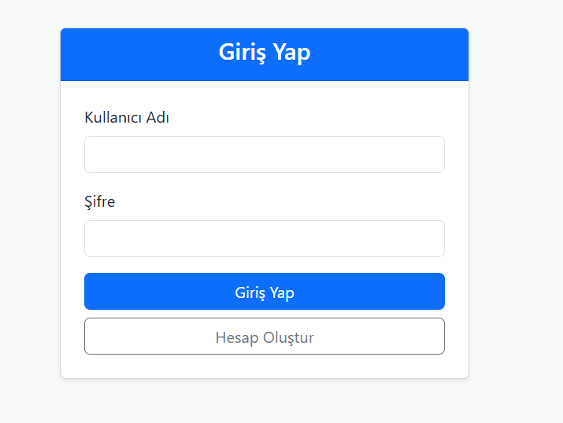
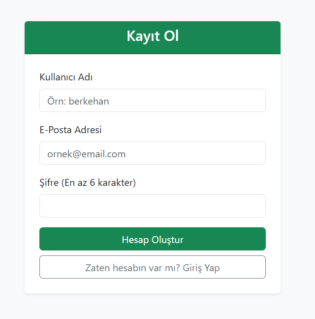

#### 2. Ana Sayfa (Dashboard)
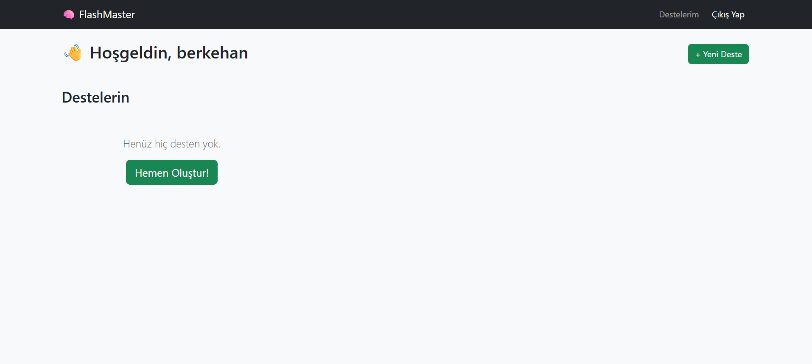
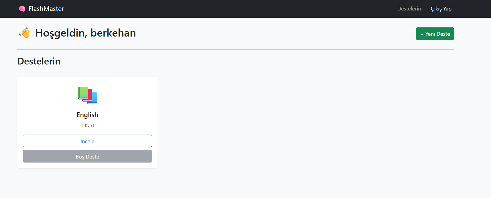

#### 3. Deste ve Kart Yönetimi
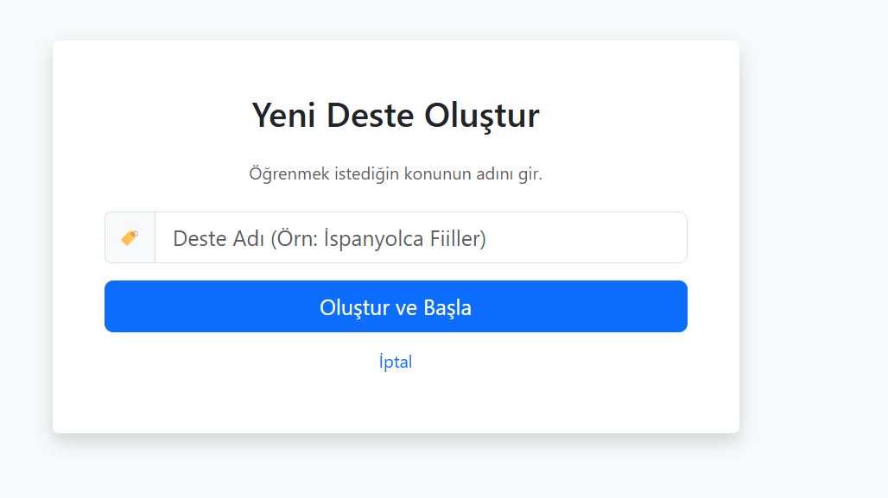
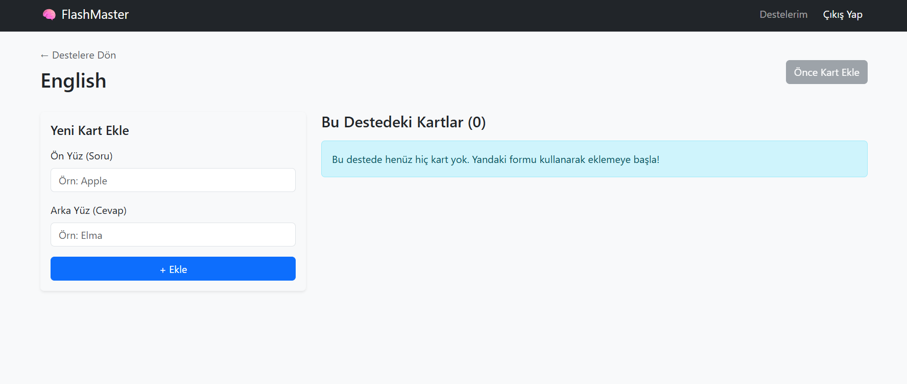
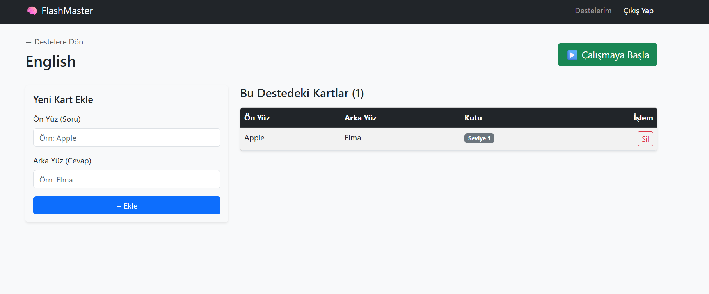
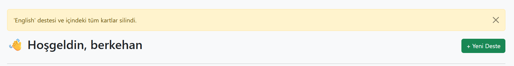

#### 4. Çalışma Modu (Leitner Sistemi)
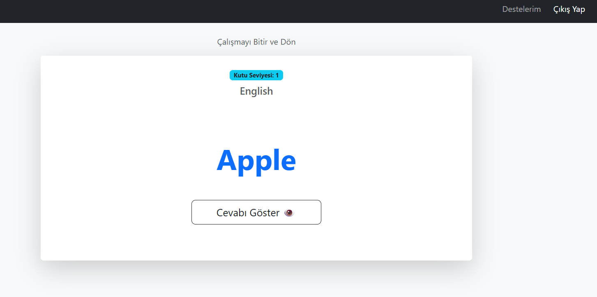
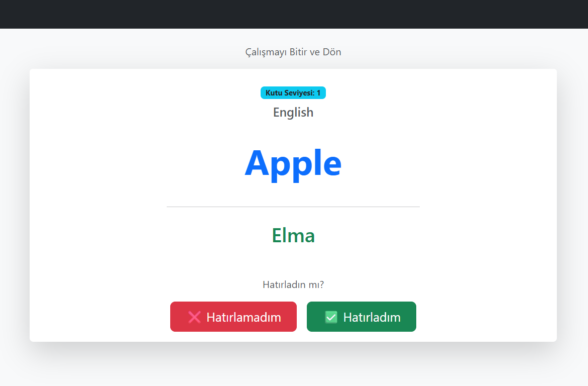
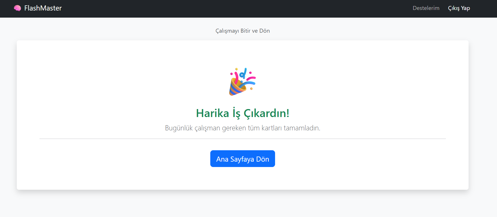